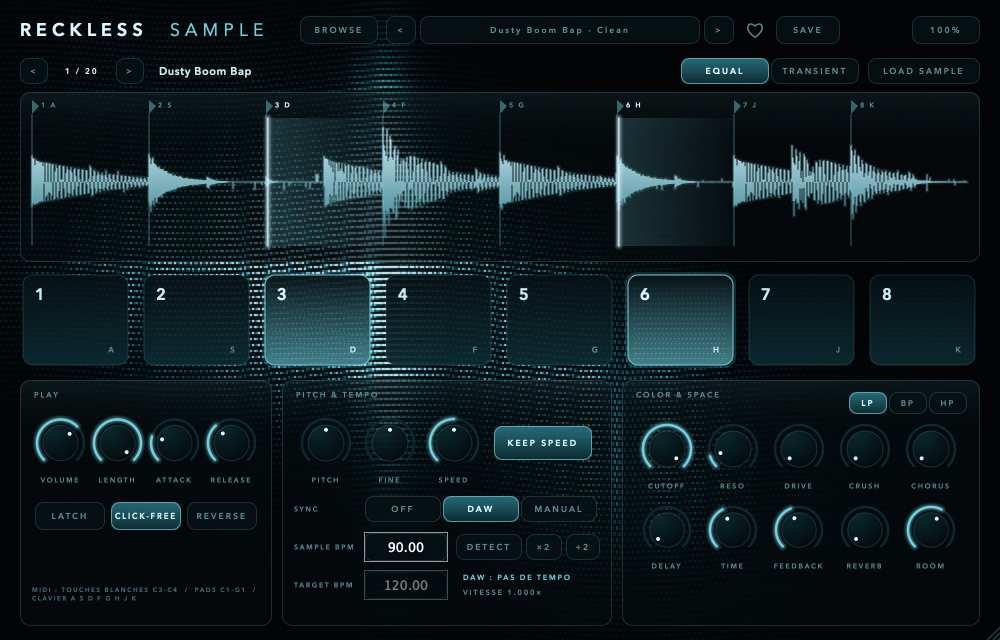
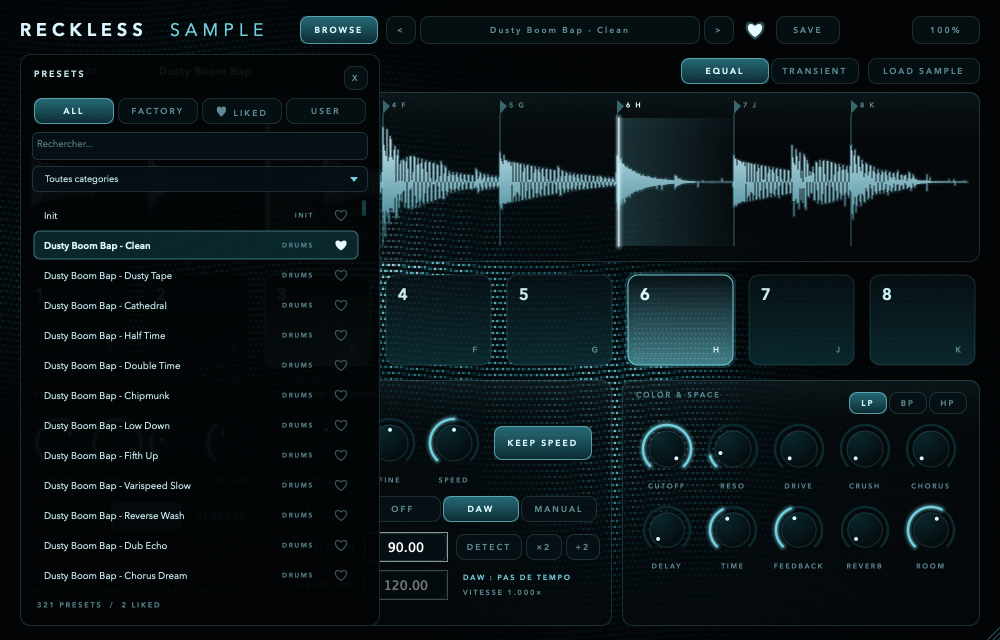

# Reckless Sample

Sampler à chops **VST3 / AU / Standalone** pour macOS (et VST3 Windows) : charge un sample, découpe-le en 8 chops, joue-les au clavier ou en MIDI, cale tout sur le tempo de ton projet et change le pitch sans toucher à la vitesse.



## Fonctions

| | |
|---|---|
| **8 chops** | Découpage égal ou sur les transitoires, repères déplaçables à la souris. Tap = joue le chop une fois, maintenir = boucle, **Latch** = un appui lance la boucle, un second l'arrête. |
| **Pitch sans changer la vitesse** | Bouton **KEEP SPEED** : le pitch (±24 demi-tons + fine) passe par un time-stretch haute qualité ([Signalsmith Stretch](https://github.com/Signalsmith-Audio/signalsmith-stretch)). Éteint, le pitch se comporte comme un vinyle (varispeed). |
| **Synchro BPM** | **SYNC DAW** cale le sample sur le tempo du projet en cours, **MANUAL** sur un tempo choisi. Le BPM du sample est détecté à l'import (ou lu dans le nom du fichier, ex. `loop_92bpm.wav`) et reste corrigeable (DETECT, ×2, ÷2). |
| **321 presets d'usine** | 20 sons synthétisés (drums, keys, pads, basses, plucks, vox, textures…) × 16 styles (Dusty Tape, Cathedral, Half Time, Chipmunk, Dub Echo, Reverse Wash…). |
| **Likes** | Clique sur le **♥** pour liker un preset. Tous tes likes sont réunis dans la banque **LIKED**. |
| **Tes presets** | **SAVE** enregistre tes réglages (sample + chops + paramètres) dans la banque **USER**. Clic droit dans le navigateur pour renommer ou supprimer. |
| **Taille réglable** | De 50 % à 200 % : menu en haut à droite ou coin de redimensionnement. La taille est mémorisée avec le projet. |
| **Animations** | Le fond reprend l'esthétique de la photo de référence (lignes de points lumineux derrière un verre flou) et réagit au son : halo sur le pad joué, balayage lumineux à chaque frappe, ondulation des lignes avec le volume. |
| **Effets** | Filtre LP/BP/HP, drive, crush, chorus, delay ping-pong synchronisé, reverb. |



## Jouer

- **Clavier de l'ordinateur** : `A S D F G H J K` = chops 1 à 8 (quand le plugin a le focus).
- **MIDI** : touches blanches **C3 à C4** (Do3 Ré3 Mi3 Fa3 Sol3 La3 Si3 Do4), ou **C1 à G1** pour les pads de contrôleurs type MPC.
- **Souris** : clique sur un pad ou directement dans la forme d'onde.
- **Charger un sample** : glisse un fichier audio (WAV, AIFF, FLAC, MP3, OGG…) sur le plugin ou clique sur **LOAD SAMPLE**. Les flèches `<` `>` parcourent les sons d'usine, ou les autres fichiers du même dossier.

## Installer (macOS)

1. Télécharge le zip voulu dans la page [Releases](../../releases), ou dans les artefacts du dernier build [Actions](../../actions).
2. Copie :
   - `Reckless Sample.component` dans `~/Library/Audio/Plug-Ins/Components/` (AU : Logic, GarageBand, Ableton…)
   - `Reckless Sample.vst3` dans `~/Library/Audio/Plug-Ins/VST3/`
3. Le plugin n'est pas signé par Apple. Si macOS le bloque, lance une fois :

```bash
xattr -dr com.apple.quarantine ~/Library/Audio/Plug-Ins/Components/"Reckless Sample.component" ~/Library/Audio/Plug-Ins/VST3/"Reckless Sample.vst3"
```

Tes presets et tes likes sont rangés dans `~/Library/Application Support/Reckless Sample/` (`Presets/*.rspreset` et `likes.json`). Ils sont partagés par tous tes projets.

## Compiler

Prérequis : CMake ≥ 3.24, un compilateur C++20 (Xcode ou Command Line Tools sur macOS, Visual Studio 2022 sur Windows).

```bash
git clone --recursive https://github.com/RecklessBoise/reckless-sample.git
```

```bash
cd reckless-sample && cmake -B build -DCMAKE_BUILD_TYPE=Release && cmake --build build --config Release
```

Les plugins sont dans `build/RecklessSample_artefacts/Release/` et les tests se lancent avec `build/RecklessSampleTests_artefacts/Release/RecklessSampleTests`. Ajoute `-DRS_COPY_PLUGINS=ON` pour copier automatiquement les plugins dans les dossiers système après le build.

> **Command Line Tools cassés ?** Si la compilation échoue avec `'utility' file not found`, ton installation des Command Line Tools ne trouve plus les en-têtes C++. Réinstalle-les (`sudo rm -rf /Library/Developer/CommandLineTools && xcode-select --install`) ou, en attendant, exporte ces variables avant `cmake` :
> `export CXXFLAGS="-nostdinc++ -isystem $(xcrun --show-sdk-path)/usr/include/c++/v1" OBJCXXFLAGS="$CXXFLAGS"`

## Architecture

```
Source/
  PluginProcessor     paramètres, MIDI, état de session, thread de rendu
  PluginEditor        interface redimensionnable (vectorielle, mise à l'échelle)
  dsp/ChopRenderer    pré-rendu des chops : varispeed + time-stretch (thread de fond)
  dsp/SamplerEngine   8 voix (tap / hold / latch), fondus anti-clic, crossfade au re-rendu
  dsp/BpmDetector     tempo via flux spectral + autocorrélation, calé sur la longueur du loop
  dsp/FactorySamples  les 20 sons d'usine, synthétisés en code (aucun fichier audio tiers)
  dsp/FxChain         drive, crush, filtre, chorus, delay, reverb
  presets/            presets d'usine, presets utilisateur, likes
  ui/                 thème, fond animé, forme d'onde, pads, navigateur
Tests/                tests unitaires (BPM, rendu pitch/tempo, moteur, presets)
Tools/Snapshot.cpp    génère les captures d'écran du README
```

Le pitch et le tempo sont appliqués **hors du thread audio** : chaque fois qu'un réglage change (ou que le tempo du DAW bouge), les 8 chops sont re-rendus en arrière-plan puis échangés sans clic. Le thread audio ne fait que lire des buffers, sans allocation ni verrou bloquant.

## Origine et licence

Reckless Sample est inspiré du fonctionnement du sampler web [Pluko](https://pluko.us/sampler.html) : 8 chops, hold to loop, latch, click-free. Le code de Pluko n'est pas public, donc rien n'en a été copié : tout le code et tous les sons ont été écrits ou synthétisés pour ce projet.

- Code : [GNU AGPLv3](LICENSE), imposée par [JUCE](https://juce.com) (utilisé sous sa licence AGPLv3).
- [Signalsmith Stretch](https://github.com/Signalsmith-Audio/signalsmith-stretch) et [Signalsmith Linear](https://github.com/Signalsmith-Audio/linear) : licence MIT.
- VST est une marque déposée de Steinberg Media Technologies GmbH. Audio Unit est une marque d'Apple Inc.
